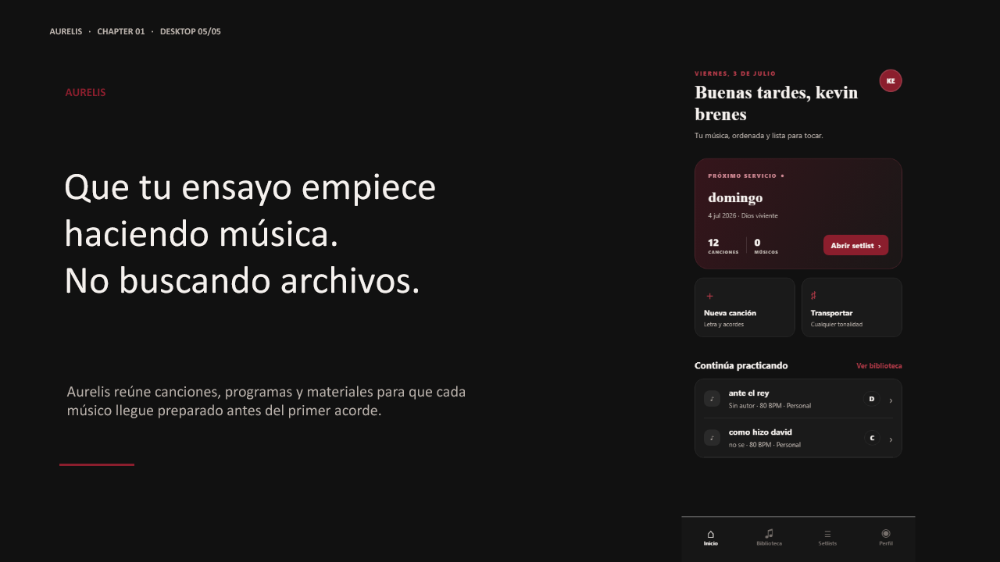
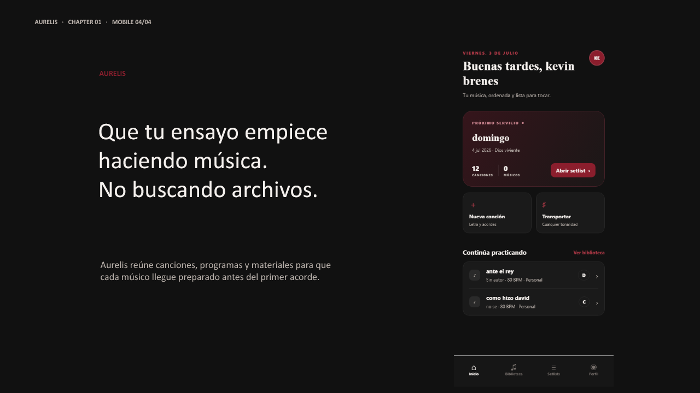
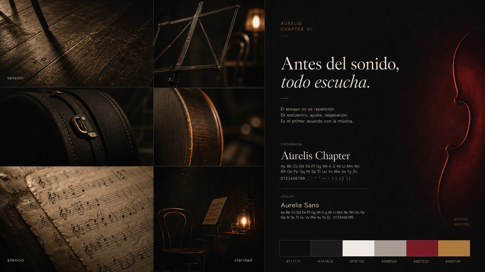

# Aurelis — Landing Storyboard · Chapter 01

Versión: Product Design Sprint 31  
Fecha: 5 de julio de 2026  
Estado: propuesta visual navegable refinada; no autoriza implementación

## Prototipo navegable

[Abrir prototipo Chapter 01](assets/chapter-01/aurelis-chapter-01-prototype.pptx)

El archivo contiene un recorrido secuencial de 12 pantallas: cinco momentos
desktop, cuatro composiciones mobile y tres láminas de dirección narrativa. Se
navega con avance/retroceso y no contiene código ni comportamiento de producto.

## Intención

Chapter 01 cuenta un solo momento: todos llegaron al ensayo, pero la música debe
esperar mientras el grupo reconstruye información dispersa.

La pieza no intenta convencer mediante funcionalidades. Primero reconoce una
experiencia real, después deja que esa incomodidad respire y únicamente entonces
presenta Aurelis como una consecuencia natural.

La transformación emocional es:

> reconocimiento → fricción → pérdida de foco → silencio → alivio → comienzo

## Storyboard completo

### Pantalla 01 — El espacio está listo

**Qué ocurre**

Entramos a una sala de ensayo pocos minutos antes de comenzar. Hay atriles,
instrumentos, fundas abiertas y luz práctica. La sala está temporalmente vacía;
todo indica que alguien está por entrar, pero nadie toca.

**Qué aparece**

- un encuadre amplio, quieto y humano;
- detalles de preparación real, no una banda posando;
- la primera frase: “¿Quién tiene la versión buena?”.

**Qué desaparece**

Nada todavía. La escena debe sentirse normal antes de revelar el problema.

**Qué cambia**

La expectativa de escuchar música se convierte en espera.

### Pantalla 02 — Las pequeñas interrupciones

**Qué ocurre**

Las frases aparecen una por una en distintos puntos del espacio. No se presentan
como chat ni como notificaciones: son voces dentro del ensayo.

**Qué aparece**

1. “¿Cuál sigue?”
2. “¿En qué tono quedó?”
3. “Espera…”
4. “No era ese archivo…”
5. “Denme un minuto…”

**Qué desaparece**

El espacio negativo se reduce gradualmente. No añadimos objetos; son las dudas
las que ocupan la composición.

**Qué cambia**

La escena continúa calmada, pero el músico reconoce la fricción. El problema no
es dramático: es cotidiano, repetido y costoso.

### Pantalla 03 — La música queda fuera

**Qué ocurre**

La cámara deja de buscar personas y se detiene en los instrumentos esperando.
Las voces ya dominan la escena.

**Qué aparece**

Una última pausa visual alrededor de “Denme un minuto…”.

**Qué desaparece**

Las frases anteriores pierden contraste y profundidad hasta quedar sólo como una
memoria breve.

**Qué cambia**

La atención abandona el repertorio y se concentra en resolver organización.

### Pantalla 04 — Silencio

**Qué ocurre**

Todo se retira. No hay fotografía, interfaz ni CTA durante un instante.

**Qué aparece**

> El ensayo todavía no empieza.  
> Pero la música ya dejó de ser lo importante.

**Qué desaparece**

- sala;
- voces;
- marcas;
- movimiento;
- cualquier promesa comercial.

**Qué cambia**

El visitante deja de observar una escena y reconoce su consecuencia. Éste es el
punto de mayor empatía del capítulo.

### Pantalla 05 — La música vuelve al centro

**Qué ocurre**

Después del statement existe otra pausa. Todavía no aparece marca, producto ni
interfaz.

**Qué aparece**

> La música merece volver a ocupar el centro.

**Qué desaparece**

El lenguaje del problema. La pieza deja de describir fricción y recupera la
intención musical.

**Qué cambia**

La historia encuentra dirección antes de presentar una respuesta.

### Pantalla 06 — Aparece Aurelis

**Qué ocurre**

Una línea color vino y una respiración de luz introducen el nombre Aurelis. No
entra como solución espectacular; entra como orden después del silencio.

**Qué aparece**

- marca tipográfica discreta;
- un fondo todavía oscuro, ahora ligeramente cálido;
- la primera superficie organizada.

**Qué desaparece**

La textura de tensión. El grano y las sombras irregulares se vuelven más estables.

**Qué cambia**

La composición pasa de fragmentos dispersos a una retícula clara.

### Pantalla 07 — La promesa y la prueba

**Qué ocurre**

La propuesta se expresa con una sola idea.

**Qué aparece**

> Que tu ensayo empiece haciendo música.  
> No buscando archivos.

Subtexto:

> Aurelis reúne canciones, programas y materiales para que cada músico llegue
> preparado antes del primer acorde.

**Qué desaparece**

Las frases del problema ya no regresan. La historia no compara listas de
funciones ni explica tecnología.

**Qué cambia**

El ritmo se vuelve firme y legible. La persona ya entiende por qué existe
Aurelis antes de ver el producto.

**Qué aparece**

- el Home real archivado de Aurelis, sin rediseño;
- su programa principal como evidencia de “todo listo”.

**Qué desaparece**

La cámara del ensayo queda atrás; permanecen su temperatura y materiales.

**Qué cambia**

La espera se convierte en posibilidad de acción. El capítulo termina sin CTA en
esta iteración para validar primero si la historia genera comprensión.

## Wireframe de alta fidelidad — Desktop

### Composición

- Lienzo de referencia: 1440 px de ancho.
- La sala ocupa el primer viewport para permitir identificación antes de marca.
- Las voces usan posiciones distintas, pero comparten escala y tratamiento para
  sentirse parte de un mismo momento.
- El silencio ocupa una franja completa sin producto ni fotografía.
- La promesa usa una retícula asimétrica: texto a la izquierda y Home entrando
  desde el plano inferior derecho.
- No aparece CTA: esta iteración valida historia, jerarquía y aparición del
  producto.

### Invariante para Figma

La composición utiliza directamente
`assets/archive/screens/20-real-home.png`. No se regeneró, reinterpretó ni
retocó la interfaz.

## Wireframe de alta fidelidad — Mobile

### Composición

- Lienzo de referencia: 390 px de ancho.
- La escena se apila; las voces alternan alineación para conservar la sensación
  espacial sin parecer mensajes.
- El silencio gana más altura proporcional que en desktop: en móvil la pausa
  necesita scroll real, no sólo margen.
- Headline y subtexto aparecen antes del Home.
- El Home se revela por debajo, nunca detrás del texto.
- No se introduce fotografía de modelos ni personas mirando a cámara.

## Moodboard

### Colores

| Papel narrativo | Color | Justificación |
| --- | --- | --- |
| Sala y silencio | `#111111` | Permite que la escena se sienta íntima y que el vacío tenga peso. |
| Superficies | `#1A1A1A` | Mantiene continuidad con Aurelis sin convertir todo en negro plano. |
| Voz principal | `#F5F1EE` | Marfil cálido: humano, legible y menos clínico que blanco puro. |
| Voz secundaria | `#B8B0AA` | Reduce competencia y sostiene la calma. |
| Resolución Aurelis | `#8B1E2D` | El vino aparece sólo cuando llega el orden; no colorea el problema. |
| Luz del ensayo | `#B88746` | Conecta con madera, atriles y luz práctica, no con una interfaz tecnológica. |

### Tipografía

- **Serif editorial cálida:** statement y headline. Su ritmo introduce pausa,
  humanidad y memoria; no debe sentirse ornamental ni lujosa.
- **Sans-serif contemporánea y discreta:** voces y subtexto. Resuelve
  información sin competir con la historia.
- En Figma deben evaluarse familias con licencia y buen español. Esta propuesta
  define contraste de voces, no selecciona aún una familia oficial.

### Iluminación

La escena inicial usa una sola fuente tungsteno lateral. El problema vive en
sombras reales, no en efectos de alarma. Durante el silencio la luz casi
desaparece. Al llegar Aurelis aparece un resplandor vino muy contenido: suficiente
para comunicar orden, nunca espectáculo.

### Composición

La primera parte es fragmentaria; la segunda, vacía; la tercera, alineada. La
retícula también cuenta la historia: dispersión → pausa → orden.

### Referencias visuales internas

- madera usada de una sala de ensayo;
- papel de partitura manipulado;
- metal mate de un atril;
- tela de una funda de instrumento;
- luz práctica antes de un ensayo nocturno;
- el lenguaje oscuro, cálido y color vino ya presente en Aurelis.

No se utilizaron landings SaaS como referencia.

### Atmósfera

Íntima, nocturna, reconocible y tranquila. Debe sentirse como estar dentro del
ensayo, no como observar una campaña sobre músicos.

## Propuesta de animaciones

Ninguna animación existe para decorar. Todas pueden reducirse o eliminarse con
`prefers-reduced-motion` sin perder la historia.

### 1. Respiración de sala

- **Movimiento:** avance óptico casi imperceptible, máximo 1%; sin capas flotantes.
- **Por qué existe:** establece presencia antes de las palabras.
- **Emoción:** anticipación tranquila.
- **Aporte:** confirma que el ensayo está a punto de comenzar sin usar video
  protagonista.

### 2. Voces que ocupan el espacio

- **Movimiento:** cada frase aparece en 220–280 ms con opacidad y 8 px de
  desplazamiento; separación de 450–650 ms.
- **Por qué existe:** reproduce la acumulación gradual de interrupciones.
- **Emoción:** reconocimiento primero, ligera incomodidad después.
- **Aporte:** convierte ejemplos aislados en un patrón cotidiano.

### 3. Pérdida de foco

- **Movimiento:** instrumentos reducen contraste 8–12% mientras la última voz
  permanece nítida.
- **Por qué existe:** materializa que la música dejó de ser el centro.
- **Emoción:** una pequeña ausencia, no ansiedad.
- **Aporte:** prepara el statement sin explicarlo antes de tiempo.

### 4. Corte a silencio

- **Movimiento:** fundido breve a negro y pausa inmóvil de 600–800 ms antes del
  texto.
- **Por qué existe:** permite comprender la consecuencia.
- **Emoción:** reflexión.
- **Aporte:** es la bisagra narrativa; sin esta pausa Aurelis parecería un anuncio.

### 5. Aparición de la promesa

- **Movimiento:** statement se desvanece; una línea vino se dibuja lentamente y
  revela Aurelis y el headline.
- **Por qué existe:** pasar de reconocer el problema a imaginar alivio.
- **Emoción:** calma y claridad.
- **Aporte:** el color de marca sólo aparece cuando existe una respuesta.

### 6. Home encuentra su lugar

- **Movimiento:** Home asciende 24–32 px y estabiliza su escala; sin flotación
  continua ni perspectiva excesiva.
- **Por qué existe:** presentar el producto como algo disponible y concreto.
- **Emoción:** confianza.
- **Aporte:** demuestra la promesa sin convertir la app en espectáculo.

## Mapa del ritmo

| Tiempo | Momento | Percepción |
| --- | --- | --- |
| 0–2 s | Sala preparada, instrumentos quietos | Identificación |
| 2–5.5 s | Las cinco voces aparecen gradualmente | Fricción cotidiana |
| 5.5–7 s | Instrumentos pierden foco; queda la última espera | La música se desplaza |
| 7–9 s | Negro, pausa y statement | Silencio / comprensión |
| 9–11 s | “La música merece volver a ocupar el centro” | Dirección |
| 11–13 s | Aparece Aurelis y cambia la retícula | Alivio |
| 13–16 s | Headline y Home real | Confianza |

En scroll libre, estos tiempos son proporciones narrativas y no una reproducción
automática obligatoria. El visitante siempre conserva el control.

## Responsive Strategy

La historia, orden y copy son invariantes. Sólo cambia la composición.

| Decisión | Desktop | Mobile |
| --- | --- | --- |
| Sala | Panorama horizontal con voces distribuidas | Recorte vertical con profundidad y voces alternadas |
| Acumulación | Ocurre a lo ancho y luego hacia el centro | Ocurre de arriba abajo dentro del mismo espacio |
| Silencio | Franja horizontal completa | Bloque alto que exige una respiración de scroll |
| Promesa | Texto y Home comparten plano | Texto y Home se apilan en ese orden |
| Producto | Entra desde abajo/derecha | Entra después de la promesa, centrado |

### Reglas de continuidad

1. Nunca mostrar Aurelis antes del statement.
2. Nunca eliminar el silencio para “ahorrar espacio” en móvil.
3. Nunca convertir las voces en carrusel, chat o tarjetas de funcionalidades.
4. Mantener exactamente los mismos seis ejemplos y el mismo orden emocional.
5. No usar autoplay que impida leer o que secuestre el scroll.
6. En orientación horizontal o tablet, usar la lógica desktop sin agregar escenas.

## Preguntas finales

### ¿Qué parte de la historia considera más fuerte?

El corte a silencio y el statement. En ese momento Aurelis demuestra comprensión
sin hablar todavía de sí misma. La ausencia de producto es precisamente lo que
hace creíble su aparición posterior.

### ¿Qué parte genera dudas?

La densidad exacta de las cinco voces. Son necesarias para reconocer el patrón,
pero demasiada simultaneidad puede hacer sentir el problema más dramático de lo
que es. Debe probarse si cuatro voces bastan o si las cinco conservan legibilidad
en móvil pequeño.

### ¿Qué elementos requieren todavía decisiones de Product?

1. Logotipo o tratamiento exclusivamente tipográfico para la primera aparición.
2. Familias tipográficas finales y licencias.
3. Uso de fotografía real, producción propia o ilustración editorial.
4. Si “Ver cómo funciona” desplaza dentro del mismo capítulo o abre un futuro
   Chapter 02.
5. Destino de “Comenzar con Aurelis” en esta etapa: invitado, registro o store.
6. Si el Home se presenta dentro de un dispositivo o como superficie sin marco.

### ¿Qué mejoraría antes de pasar a Figma definitivo?

1. Probar el storyboard estático con 5–7 músicos sin explicar la intención y
   preguntar qué creen que está ocurriendo.
2. Actualizar la captura real si Product declara una nueva baseline de Home.
3. Hacer dos pruebas de densidad de voces en 320 px y 390 px.
4. Validar contraste, aumento de texto y reduced motion desde el prototipo.
5. Seleccionar fotografía/ilustración mediante una prueba de autenticidad: la
   escena debe sentirse vivida, nunca posada.

## Fuera de alcance

- implementación;
- componentes;
- landing completa;
- pricing, FAQ, footer, testimonios, comunidad, blog o roadmap;
- cambios a Aurelis, Foundation o Product Design;
- definición de Chapters posteriores.
